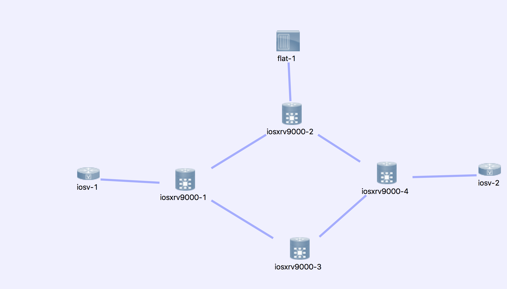

##  Opendaylight SD-WAN testing 

#####Install opendaylight karaf and install features  （Boron-SR2)
#####Build Virl network topology
        Cisco IOS XR Software, Version 6.0.1
#####BGP link state with Opendaylight controller
#####BGP monitor with opendaylight
#####BGP route inject with opendaylight
#####PCEP MPLS RSVP traffic engineering 
#####PCEP segment routing traffic engineering
#####Netconf edit configuration to create service ,direct traffic to LSP tunnel etc.

### Opendaylight SD-WAN testing topology

iosv-1 send traffic to iosv-2 via two path options, iosxrv9000-2 setup BGP address family BGP link state , 
redistribute OSPF linkstate to BGP and send to Opendaylight controller .

iosxrv9000-1 configed as BMP client , opendaylight in flat-1 network as BMP server to collect BGP data.

iosxrv9000-1 configed as PCC conected to opendaylight as PCE , opendaylight create LSP and push to PCC.

### IOS XR 9kv dosen't support BGP flowSpec install local interface operation .......